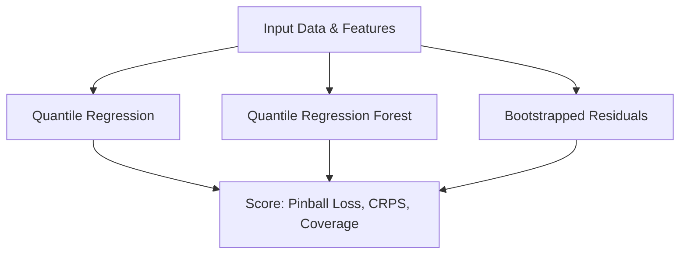

> **Series:** Wave Energy | **Part:** 4 (Flux Forecasting: Probabilistic Forecasting)

---

## Introduction

Deterministic point forecasts (like the LightGBM models in [Part 1](/EnergyForecasting/Wave_Energy/Wave_Energy_Flux_Forecasting_part1/) or the Stacking Ensemble in [Part 2](/EnergyForecasting/Wave_Energy/Wave_Energy_Flux_Forecasting_part2/)) predict a single expected value. However, wave energy operations depend heavily on understanding extreme scenarios (storms and calms). Underestimating wave heights can result in structural damage to wave energy converters, while overestimating them leads to costly, unnecessary maintenance delays.

This part transitions from single-point forecasts to **probabilistic forecasts**. We evaluate three techniques:
1.  **Quantile Regression (QR):** Linear quantile estimation per quantile.
2.  **Quantile Regression Forest (QRF):** Non-parametric random forests that extract leaf distribution values.
3.  **Bootstrapped Residuals:** A point model combined with resampled validation errors (using in-sample, out-of-sample, and binned/conditional residuals).

---

## 1. Methodology Summary

The testing setup mirrors our previous walk-forward validation framework:
*   **6 walk-forward folds:** 1-month validation and 1-month test windows, with an expanding training window.
*   **Target Variables:** Significant Wave Height ($H_s$ / `swh`) and Mean Wave Period ($T_e$ / `mwp`) at $1h, 3h, 6h, 12h, 24h,$ and $48h$ lead times.
*   **Quantiles Estimated:** 13 quantile levels: $\tau \in \{0.025, 0.05, 0.10, 0.20, 0.30, 0.40, 0.50, 0.60, 0.70, 0.80, 0.90, 0.95, 0.975\}$.
*   **Evaluation Metrics:** Pinball Loss, Continuous Ranked Probability Score (CRPS), Empirical Coverage ($\text{Cov}_{\beta}$), and Mean Interval Width ($\text{Width}_{\beta}$) for $80\%$, $90\%$, and $95\%$ nominal confidence intervals.

---

## 2. Comparative Results

### 2.1 Probabilistic Metrics Comparison
The table below aggregates the mean cross-validation performance across folds for select lead times ($1h, 12h, 24h, 48h$).

#### Significant Wave Height ($H_s$ / `swh`)

| Lead (h) | Model | Pinball Loss | CRPS | $80\%$ Coverage | $80\%$ Width | $95\%$ Coverage | $95\%$ Width |
| :--- | :--- | :--- | :--- | :--- | :--- | :--- | :--- |
| **1h** | **QR** | **0.0095** | **0.0190** | $79.3\%$ | $0.100$ | $96.4\%$ | $0.168$ |
| | **QRF** | $0.0100$ | $0.0201$ | $89.1\%$ | $0.121$ | $98.1\%$ | $0.198$ |
| | **Bootstrap** | $0.0100$ | $0.0201$ | $82.9\%$ | $0.106$ | $95.9\%$ | $0.208$ |
| **12h** | **QR** | **0.0883** | **0.1766** | $79.6\%$ | $0.909$ | $95.0\%$ | $1.480$ |
| | **QRF** | $0.0913$ | $0.1826$ | $81.3\%$ | $0.965$ | $96.1\%$ | $1.565$ |
| | **Bootstrap** | $0.0895$ | $0.1790$ | $83.5\%$ | $1.000$ | $96.1\%$ | $1.749$ |
| **24h** | **QR** | **0.1327** | **0.2653** | $79.3\%$ | $1.361$ | $95.0\%$ | $2.134$ |
| | **QRF** | $0.1416$ | $0.2833$ | $76.3\%$ | $1.428$ | $93.3\%$ | $2.188$ |
| | **Bootstrap** | $0.1342$ | $0.2685$ | $82.8\%$ | $1.545$ | $96.6\%$ | $2.415$ |
| **48h** | **QR** | **0.1618** | **0.3237** | $82.3\%$ | $1.752$ | $96.2\%$ | $2.654$ |
| | **QRF** | $0.2021$ | $0.4041$ | $67.6\%$ | $1.676$ | $90.2\%$ | $2.527$ |
| | **Bootstrap** | $0.1780$ | $0.3560$ | $76.5\%$ | $1.972$ | $94.7\%$ | $2.945$ |

#### Mean Wave Period ($T_e$ / `mwp`)

| Lead (h) | Model | Pinball Loss | CRPS | $80\%$ Coverage | $80\%$ Width | $95\%$ Coverage | $95\%$ Width |
| :--- | :--- | :--- | :--- | :--- | :--- | :--- | :--- |
| **1h** | **QR** | $0.0271$ | $0.0542$ | $78.5\%$ | $0.252$ | $93.1\%$ | $0.443$ |
| | **QRF** | $0.0278$ | $0.0557$ | $82.9\%$ | $0.284$ | $95.7\%$ | $0.507$ |
| | **Bootstrap** | **0.0267** | **0.0534** | $81.0\%$ | $0.261$ | $94.9\%$ | $0.499$ |
| **12h** | **QR** | **0.2217** | **0.4434** | $78.6\%$ | $2.174$ | $93.8\%$ | $3.607$ |
| | **QRF** | $0.2297$ | $0.4594$ | $79.3\%$ | $2.267$ | $93.9\%$ | $3.739$ |
| | **Bootstrap** | $0.2260$ | $0.4520$ | $80.7\%$ | $2.434$ | $95.7\%$ | $4.216$ |
| **24h** | **QR** | **0.3059** | **0.6118** | $77.1\%$ | $3.030$ | $92.8\%$ | $4.716$ |
| | **QRF** | $0.3231$ | $0.6462$ | $73.9\%$ | $3.017$ | $91.1\%$ | $4.714$ |
| | **Bootstrap** | $0.3125$ | $0.6250$ | $80.2\%$ | $3.426$ | $95.6\%$ | $5.652$ |
| **48h** | **QR** | **0.3448** | **0.6895** | $76.0\%$ | $3.558$ | $93.1\%$ | $5.320$ |
| | **QRF** | $0.3720$ | $0.7440$ | $71.8\%$ | $3.401$ | $89.3\%$ | $5.077$ |
| | **Bootstrap** | $0.3628$ | $0.7256$ | $79.3\%$ | $4.018$ | $95.2\%$ | $5.864$ |

### 2.2 Key Takeaways
1.  **QR dominates overall accuracy:** Quantile Regression achieves the lowest Pinball Loss and CRPS at almost all lead times for both wave height and wave period.
2.  **QRF performs well at short horizons:** QRF is competitive at 1h–3h but degrades significantly at longer lead times (e.g., 48h). This is because the random forest's ensemble leaf averaging struggles to extrapolate to extreme conditions.
3.  **Bootstrapped Residuals are highly cost-efficient:** While QRF requires extensive memory to keep forests on disk, and QR requires fitting 13 independent regressions, Bootstrapped Residuals require fitting just **one** LightGBM point model and adjusting it with validation residuals. Despite this simplicity, it achieves CRPS metrics that are remarkably close to QR.

<figure>
  
  <figcaption>Fig. 1: Reliability diagram comparing QR and QRF calibration for SWH.</figcaption>
</figure>

### 2.3 Forecast Visualizations

To visualize the prediction intervals across different lead times, we compare the short-term and long-term forecasts for Significant Wave Height ($H_s$):

<figure>
  
  <figcaption>Fig. 2: Bootstrapped residuals prediction interval for SWH at 6h lead time.</figcaption>
</figure>

<figure>
  
  <figcaption>Fig. 3: Bootstrapped residuals prediction interval for SWH at 48h lead time (Graphical Abstract).</figcaption>
</figure>

---

## 3. Comparison with Stacking Ensemble (Part 2)

Evaluating the median ($q_{0.50}$) forecast of the probabilistic models against Part 2's Ridge-Stacking point-forecaster helps us assess whether training with quantile-specific objectives affects central accuracy.

#### Significant Wave Height ($H_s$ / `swh`) Point Metrics (MAE / RMSE)

| Lead (h) | Stacking Ensemble | QR (Median) | QRF (Median) | Bootstrapped (Median) |
| :--- | :--- | :--- | :--- | :--- |
| **1h** | **0.02 / 0.02** | $0.031 / 0.045$ | $0.032 / 0.047$ | **0.031 / 0.044** |
| **12h** | **0.13 / 0.19** | $0.292 / 0.392$ | $0.302 / 0.401$ | $0.284 / 0.385$ |
| **24h** | **0.23 / 0.30** | $0.448 / 0.580$ | $0.482 / 0.610$ | $0.440 / 0.568$ |
| **48h** | **0.34 / 0.44** | $0.559 / 0.701$ | $0.701 / 0.867$ | $0.606 / 0.732$ |

#### Mean Wave Period ($T_e$ / `mwp`) Point Metrics (MAE / RMSE)

| Lead (h) | Stacking Ensemble | QR (Median) | QRF (Median) | Bootstrapped (Median) |
| :--- | :--- | :--- | :--- | :--- |
| **1h** | **0.07 / 0.09** | $0.085 / 0.123$ | $0.088 / 0.125$ | $0.083 / 0.118$ |
| **12h** | **0.66 / 0.84** | $0.716 / 0.958$ | $0.744 / 0.985$ | $0.718 / 0.958$ |
| **24h** | **0.84 / 1.03** | $1.013 / 1.302$ | $1.058 / 1.371$ | $1.021 / 1.303$ |
| **48h** | **0.95 / 1.19** | $1.151 / 1.437$ | $1.237 / 1.515$ | $1.207 / 1.469$ |

*Observation:* The Stacking Ensemble consistently outperforms the median forecasts of the probabilistic estimators. This is expected: the stacking ensemble is optimized explicitly for mean squared error (MSE) using regularized base predictions, whereas the median forecasts ($q_{0.50}$) are optimized for mean absolute error (MAE) under the pinball loss. This highlight the classical trade-off: **to obtain reliable probabilistic intervals, we must accept a slight penalty in raw point accuracy.**

<figure>
  
  <figcaption>Fig. 4: Fan chart of bootstrapped residuals forecasting SWH (24h lead time).</figcaption>
</figure>

---

## 4. Deep Dive: Bootstrapped Residual Strategies

A key limitation of the basic out-of-sample residual bootstrap is that it is *unconditional*: it applies the same error distribution offset across the entire test set. In practice, prediction uncertainty is heteroscedastic; we expect wider intervals during storms and narrower intervals during calm weather.

We compared three residual strategies on the final fold for $24h$ SWH forecasting:
1.  **In-sample residuals:** Residuals computed on training data. Usually overoptimistic and too narrow due to overfitting.
2.  **Out-sample residuals:** Validation set residuals. Provides correct overall coverage, but has a constant interval width regardless of conditions.
3.  **Binned (Conditional) residuals:** Out-of-sample residuals grouped into 15 bins based on the predicted value. A test prediction uses residuals from the corresponding bin.

| Method | Nominal Coverage | Empirical Coverage | Cumulative Interval Area |
| :--- | :--- | :--- | :--- |
| **In-sample residuals** | $80.0\%$ | $89.2\%$ | $768.70$ |
| **Out-sample residuals (Unconditional)** | $80.0\%$ | $85.6\%$ | $671.57$ |
| **Out-sample residuals (Binned)** | $80.0\%$ | **$87.1\%$** | **$455.34$** |

### Why Binned Residuals Win
By grouping residuals based on predicted wave heights, the model builds intervals that scale with predicted conditions. 

*   During calm periods, the model uses validation errors from other calm predictions, producing narrow intervals.
*   During storms, it scales the intervals up. 

This conditional approach achieves a much smaller cumulative interval area ($455.34$ vs $671.57$ unconditional) while maintaining reliable empirical coverage ($87.1\%$).

<figure>
  
  <figcaption>Fig. 5: Interval widths compared across the three bootstrapping methods.</figcaption>
</figure>

---

## Conclusion

This concludes our wave energy forecasting series:
*   **Part 1** established baseline deterministic modeling using LightGBM.
*   **Part 2** recovered long-lead prediction capabilities by building a Stacking Meta-model.
*   **Part 3** added probabilistic bounds, comparing QR, QRF, and Bootstrapped Residuals.

Quantile Regression yields the highest overall probabilistic accuracy, while conditional (binned) Bootstrapped Residuals offer an elegant, computationally inexpensive alternative that scales uncertainty intervals dynamically with sea conditions.

---

## References

*   ["Probabilistic Forecasting: Bootstrapped Residuals User Guide"](https://skforecast.org/0.15.0/user_guides/probabilistic-forecasting-bootstrapped-residuals), skforecast documentation.
*   Koenker, R. (2005). *Quantile Regression*. Cambridge University Press.
*   Meinshausen, N. (2006). "Quantile Regression Forests". *Journal of Machine Learning Research*.

## Code

*   [qr_qrf_wave_pipeline.py](/EnergyForecasting/Wave_Energy/3_Wave_Energy_Flux_Forecasting_part3/4_QR_QRF_Probabilistic/qr_qrf_wave_pipeline.py): Implements walk-forward cross-validation for QR and QRF.
*   [bootstrap_residual_wave_pipeline.py](/EnergyForecasting/Wave_Energy/3_Wave_Energy_Flux_Forecasting_part3/5_Bootstrap_Residuals_Probabilistic/bootstrap_residual_wave_pipeline.py): Generates probabilistic distributions using LightGBM validation residuals.
*   [bootstrap_residuals_deep_dive.py](/EnergyForecasting/Wave_Energy/3_Wave_Energy_Flux_Forecasting_part3/5_Bootstrap_Residuals_Probabilistic/bootstrap_residuals_deep_dive.py): Compares in-sample, out-sample, and conditional binned bootstrapping methods.
