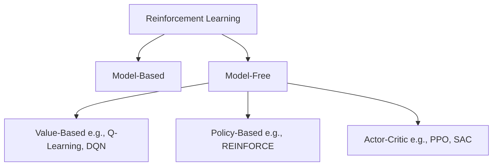

Original content synthesized from: MathWorks, IBM, Google Cloud, and OpenAI Spinning Up (Parts 1–3)

---

## 1. What is Reinforcement Learning?

At its core, **Reinforcement Learning (RL)** is a machine learning paradigm focused on training an agent to make a sequence of decisions. By interacting with an environment through trial and error, the agent learns to take actions that maximize a cumulative reward over time.

Unlike supervised learning, which relies on a pre-labeled dataset of correct answers, RL requires the agent to discover optimal strategies autonomously from the feedback it receives.

---

## 2. How Reinforcement Learning Works

The training process in RL mirrors how humans and animals learn from their surroundings. A classic analogy is training a pet: when a dog performs a desired action, it receives a treat. Over time, the dog associates certain actions with positive outcomes and alters its behavior accordingly.

*Figure 1: Pet training as an intuitive model for Reinforcement Learning (Source: MATLAB & Simulink)*

In this scenario:

* **Agent (The Learner):** The dog.
* **Environment (The World):** The trainer and the surrounding room.
* **State / Observation:** The dog hears a command ("Sit") and observes the trainer's posture.
* **Action:** The dog decides to sit, stand, or bark.
* **Reward:** A tasty treat (positive reinforcement) or no treat (neutral/negative reinforcement).

By repeating this interaction loop, the dog learns to maximize its "rewards."

### RL in the Modern Era

Recent breakthroughs in deep learning combined with massive increases in compute power have expanded RL's capabilities far beyond simple tasks. Today, deep reinforcement learning powers systems that defeat grandmasters at Go (AlphaGo), align large language models with human preferences (RLHF in ChatGPT), and control complex robotic systems.

---

## 3. RL vs. Supervised vs. Unsupervised Learning

To understand where RL fits in the broader machine learning landscape, we can compare the three primary paradigms:

* **Supervised Learning:** Learns from a labeled dataset. The model makes predictions, compares them against ground-truth labels, and minimizes error (e.g., classifying images of cats and dogs).
* **Unsupervised Learning:** Finds hidden structures or patterns within unlabeled data without explicit feedback (e.g., clustering customer segments).
* **Reinforcement Learning:** Learns dynamically from interactive feedback. The agent receives rewards or penalties for its decisions and adapts its strategy accordingly.

Note that reinforcement learning and deep learning are not mutually exclusive. When deep neural networks are used to approximate policies or value functions in RL, it is called **Deep Reinforcement Learning (DRL)**.

*Figure 2: The machine learning landscape (Source: MATLAB & Simulink)*

---

## 4. Core Concepts & Terminology

Understanding RL requires getting familiar with its foundational vocabulary:

| Term                     | Symbol          | Definition                                                                                     |
| :----------------------- | :-------------- | :--------------------------------------------------------------------------------------------- |
| **Agent**          | -               | The decision-making entity that undergoes training.                                            |
| **Environment**    | -               | The external world or simulation the agent interacts with.                                     |
| **State**          | $s$           | A complete, mathematical description of the environment's current condition.                   |
| **Observation**    | $o$           | A partial or noisy description of the state (what the agent can actually perceive).            |
| **Action**         | $a$           | The choice or move made by the agent at a specific step.                                       |
| **Action Space**   | $\mathcal{A}$ | The set of all valid actions available to the agent (can be discrete or continuous).           |
| **Policy**         | $\pi$         | The agent's strategy or rule for mapping states/observations to actions.                       |
| **Reward**         | $r$           | A scalar feedback signal returned by the environment after an action.                          |
| **Return**         | $R$           | The cumulative sum of rewards collected over an entire trajectory.                             |
| **Trajectory**     | $\tau$        | A sequence of states, actions, and rewards representing a single run or episode.               |
| **Value Function** | $V(s)$        | The expected return starting from state$s$ and following a specific policy.                  |
| **Q-Function**     | $Q(s, a)$     | The expected return of taking action$a$ in state $s$ and then following a policy.          |
| **Advantage**      | $A(s, a)$     | A metric showing how much better action$a$ is compared to the average action in state $s$. |

*Figure 3: The agent-environment interaction cycle and its mathematical counterparts (AI-generated by Gemini).*

### The Interaction Loop

1. The agent observes the current state $s_t$ of the environment.
2. The agent executes an action $a_t$ based on its policy $\pi(a_t \mid s_t)$.
3. The environment transitions to a new state $s_{t+1}$ and generates a reward $r_{t+1}$.
4. This cycle repeats, generating a trajectory (or rollout) $\tau$:

$$
\tau = (s_0, a_0, r_1, s_1, a_1, r_2, \dots)
$$

---

## 5. Markov Decision Process (MDP)

To study RL mathematically, we frame the problem as a **Markov Decision Process (MDP)**.

*Figure 4: A simple gridworld where a robot must find the green house while avoiding red hazardous tiles (Source: Dive into Deep Learning)*

An MDP is defined by a 4-tuple: $(\mathcal{S}, \mathcal{A}, \mathcal{T}, \mathcal{R})$:

* **$\mathcal{S}$ (State Space):** The set of all possible states.
* **$\mathcal{A}$ (Action Space):** The set of all actions.
* **$\mathcal{T}$ (Transition Probability Function):** The probability of transitioning to state $s'$ given current state $s$ and action $a$:

$$
\mathcal{T}(s, a, s') = P(s' \mid s, a)
$$

The sum of transition probabilities to all possible next states must equal one:

$$
\sum_{s' \in \mathcal{S}} P(s' \mid s, a) = 1
$$

* **$\mathcal{R}$ (Reward Function):** The scalar reward earned for taking action $a$ in state $s$:

$$
\mathcal{R}(s, a) = \mathbb{E}[r \mid s, a]
$$

### The Discount Factor ($\gamma$)

Since trajectories can be infinitely long, summing up raw rewards could lead to mathematical divergence. To solve this and model the idea that immediate rewards are usually worth more than future ones, we introduce a **discount factor** $\gamma \in [0, 1)$.

The **discounted return** $R(\tau)$ is calculated as:

$$
R(\tau) = \sum_{t=0}^{\infty} \gamma^t r_t
$$

* When $\gamma$ is close to 0, the agent is "myopic" (focused primarily on immediate gains).
* When $\gamma$ is close to 1, the agent is "farsighted" (willing to delay gratification for larger long-term returns).

### The Markov Assumption

A process satisfies the **Markov Property** if the transition to the next state depends *only* on the current state and action, ignoring the history of how the agent got there:

$$
P(s_{t+1} \mid s_t, a_t, s_{t-1}, a_{t-1}, \dots, s_0, a_0) = P(s_{t+1} \mid s_t, a_t)
$$

If an environment violates this (e.g., predicting a robot's next position requires knowing both its current location and its velocity from the previous step), we can often restore the Markov property by expanding the state definition to include historical details (like pairing location and velocity together as a single state vector).

---

## 6. Key Trade-offs in RL

Designing and training RL agents involves balancing several fundamental trade-offs:

### 6.1 Exploration vs. Exploitation

* **Exploration:** Choosing random or unfamiliar actions to learn more about the environment and discover new strategies.
* **Exploitation:** Selecting known actions that yield high rewards based on current knowledge.

Without exploration, the agent risks getting stuck in local optima. Without exploitation, the agent never refines its policy into a high-performing strategy. One common approach is using an $\epsilon$-greedy strategy, starting with high exploration and decaying it over time as the agent masters the environment.

*Figure 5: Transitioning from exploration to exploitation during training (AI-generated by Gemini).*

### 6.2 Model-Free vs. Model-Based RL

* **Model-Free:** The agent learns directly from trial-and-error interactions without trying to understand the physics or rules of the environment.
  * *Pros:* Simple, flexible, works in highly complex settings.
  * *Cons:* Highly sample-inefficient (requires millions of trials).
* **Model-Based:** The agent builds or receives a model of the environment's transitions to simulate and plan actions before executing them.
  * *Pros:* Extremely sample-efficient.
  * *Cons:* Subject to model bias (errors in the model propagate to the policy).

### 6.3 On-Policy vs. Off-Policy Learning

* **On-Policy:** The agent evaluates and improves the exact policy it uses to collect data.
  * *Pros:* Stable updates, easier to analyze mathematically.
  * *Cons:* Inefficient; data must be discarded after every policy update.
* **Off-Policy:** The agent evaluates a target policy while behaving according to a different exploratory policy (often storing and reusing experience in a replay buffer).
  * *Pros:* Highly sample-efficient.
  * *Cons:* More unstable; updates can diverge.

### 6.4 Online vs. Offline RL

* **Online RL:** The agent learns interactively, gathering new experience in real-time.
* **Offline RL:** The agent learns from a pre-collected, static dataset of historical runs (crucial when real-world exploration is dangerous or expensive, such as autonomous driving or healthcare).

---

## 7. Taxonomy of RL Algorithms

We can categorize reinforcement learning algorithms along several core dimensions:

### Value-Based vs. Policy-Based vs. Actor-Critic

1. **Value-Based Methods:** Estimate the expected future rewards (Q-values) for each action. The agent then selects the action with the highest value. Best suited for discrete action spaces (e.g., Q-learning, DQN).
2. **Policy-Based Methods:** Directly optimize the policy parameters using gradient ascent to increase the probability of high-reward actions. Good for continuous or high-dimensional action spaces (e.g., REINFORCE).
3. **Actor-Critic Methods:** Combine both approaches. The **Actor** updates the policy based on performance, while the **Critic** estimates the value function to reduce variance and stabilize updates (e.g., PPO, SAC, DDPG).

*Figure 6: The Actor-Critic interaction flow (Source: MATLAB & Simulink)*

### Other Dimensions

* **Gradient-Based vs. Evolutionary:** Gradient-based methods use backpropagation and policy gradients. Evolutionary algorithms treat policies as black boxes and optimize them using genetic algorithms.
* **Tabular vs. Neural Network-Based:** Tabular methods store Q-values in a simple lookup table (limited to small, discrete states). Neural network approaches use deep networks to handle continuous inputs.
* **Single-Agent vs. Multi-Agent (MARL):** Single-agent setups are simpler and stable. Multi-agent settings introduce competition, coordination, and non-stationarity since other agents are constantly changing.

---

## 8. Deep Dive: Q-Learning

**Q-learning** is a classic model-free, off-policy, tabular RL algorithm. It aims to learn the optimal action-value function $Q(s, a)$, representing the expected cumulative reward of taking action $a$ in state $s$ and following the optimal policy thereafter.

*Figure 7: Q-Learning decision and update process (Source: Tutorialspoint)*

### The Temporal Difference (TD) Update Rule

At each step, the Q-value is updated using the Bellman Equation:

$$
Q(s, a) \leftarrow Q(s, a) + \alpha \left[ r + \gamma \max_{a'} Q(s', a') - Q(s, a) \right]
$$

Where:

* $\alpha$ is the learning rate.
* $r$ is the immediate reward received.
* $\gamma$ is the discount factor.
* $\max_{a'} Q(s', a')$ is the estimate of the optimal future return from the next state $s'$.
* $r + \gamma \max_{a'} Q(s', a') - Q(s, a)$ is the **Temporal Difference (TD) Error**.

---

## 9. The Reinforcement Learning Workflow

A standard RL project follows an iterative cycle:

1. **Define Environment:** Choose a simulation framework (e.g., Gymnasium) or a physical setup, and design the reward function.
2. **Create Agent:** Select the algorithm and network architecture.
3. **Collect Experience:** Run the agent to gather trajectories.
4. **Compute Updates:** Calculate TD errors or policy gradients.
5. **Update Policy:** Perform gradient steps or update Q-tables.
6. **Validate:** Test the policy in unseen conditions to check for overfitting.
7. **Deploy:** Export the trained policy (often converting it to C++ or CUDA for real-time inference).

---

## 10. Benefits and Challenges of RL

### Benefits

* Excellent for complex, sequential decision-making tasks (e.g., flight control, game-playing).
* No labeled data required; learns purely from environmental feedback.
* Highly adaptive; continues learning and adjusting after deployment.

### Challenges

* **Sample Inefficiency:** Often requires millions of environment interactions to learn basic behaviors.
* **Hyperparameter Sensitivity:** Highly sensitive to reward shaping, learning rates, and exploration decay.
* **Generalization Gap:** Policies trained in simulation often fail in the real world (known as the Sim-to-Real problem).
* **Explainability:** Neural network policies are black boxes, making them difficult to formally verify or debug.

---

## 11. Real-World Applications

RL has graduated from toy problems to critical industry applications:

| Domain                       | Application Examples                                                                    |
| :--------------------------- | :-------------------------------------------------------------------------------------- |
| **Robotics**           | Manipulation, locomotion, warehouse navigation.                                         |
| **Autonomous Driving** | End-to-end driving, lane keeping, smart parking.                                        |
| **Gaming & AI**        | Game-playing engines (AlphaGo, Dota 2 OpenAI Five).                                     |
| **NLP & LLMs**         | Reinforcement Learning from Human Feedback (RLHF) for safety and instruction alignment. |
| **Industrial Control** | Smart grid energy dispatch, HVAC optimization, factory scheduling.                      |
| **Healthcare**         | Optimizing treatment policies for dynamic diseases.                                     |

*Figure 8: AlphaGo vs. Lee Sedol (Source: Richard C. Suwandi)*
